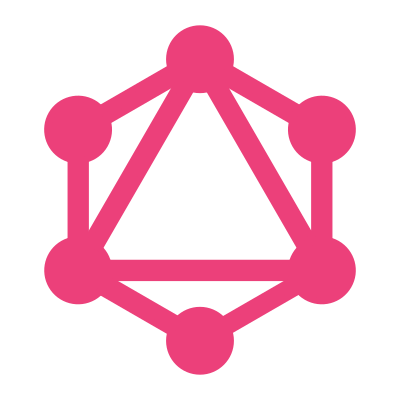

# 👋 Hullo! resyfer here!</i>

  

Let's see . . . um, 19, his/him, a coder by passion. 
I'm a Go/C++ and MEVN/MERN developer and I like Linux. I use Fedora btw :)
 

## Stuff-I-Know Tier List

Ever seen a tier-list on a Github profile? Well, here's one on my skill level:
 

S&emsp;👉&emsp;
&nbsp;
&nbsp;
&nbsp;
&nbsp;
&nbsp;
&nbsp;
&nbsp;
&nbsp;
&nbsp;
&nbsp;
&nbsp;
&nbsp;
&nbsp;
&nbsp;

 

A&emsp;👉&emsp;
&nbsp;
&nbsp;
&nbsp;

 

B&emsp;👉&emsp;
&nbsp;
&nbsp;
&nbsp;
&nbsp;
&nbsp;
&nbsp;
&nbsp;
&nbsp;

 

C&emsp;👉&emsp;
&nbsp;
&nbsp;

 

D&emsp;👉&emsp;
&nbsp;
&nbsp;
&nbsp;

 

F&emsp;👉&emsp;
&nbsp;
&nbsp;

 

## VSCode a day to keep the bugs away

  
  |  |  |
  |---|---|

## Wanna Say Hi?

Contact me here:&emsp;

## Extra Info

- <strong>My hobbies</strong>: Welp...coding, anime, novels, digital drawing and exploring Linux. Ig that's it ¯\\_(ツ)_/¯
- <strong>What I'm learning</strong>: MEVN, DSA and OS and being a better developer in general
- <strong>What I'm interested in</strong>: Go and Vue.
